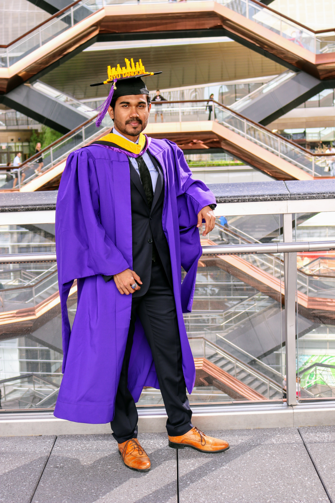

# Supreeth Kumar Kumaraswamy

## Contact

                   932-3263)

##  Skills

#### Languages/Middlewares
- NVIDIA Isaac, ROS, Python, C / C++, SQL, MATLAB, ROS2

#### Specializations
- OpenCV, Ansible, Mapping, Localization, Motion Planning, Robot Kinematics, Perception, Mechatronics

#### Platforms 
- Linux, VIM, NVIDIA Jetson Platforms, Prototyping, 3D CAD  Modeling, Hardware Development, Autoware,  Microcontrollers, Soldering, Laser Cutting, Photoshop, SMI Animatics Motors

#### Sensors 
- Velodyne, TIM Sick, Scanse, Bosch ECU & Proximity, Bosch IMU (SMI 230 & BNO055) 
- UR10e manipulator, MoveIt

#### Project planning and Testing 
- MS Project Professional, Jira, TestRail, Xray 

##  Experience

###  Knightscope, Mountain View

#### Sr. Robotics Software Engineer
- AUG 2019 - PRESENT
- Lead the Knightscope’s (KI) Autonomous Data Machine (ADM) Core team to work on a Research and Development project. This project helps Knightscope in improving overall robot navigation and reduction in operational and service cost with a newer K5 robot body and sensors.
- Designing and prototyping the sensors, navigation stack, state machine and other components; keeping robustness and easy serviceability of the KI robots in mind. 
- Implement the Park feature especially for snowy areas (harsh weather) so the robot could stay docked to the charging station by varying its voltage, current and temperature. This feature reduced the operation cost by over 10%.
- Autonomously detect a charging dock using robot camera and lidars, and safely dock
into it to charge indoor robots, reducing operating costs by over 15%.
- Capture of error state, and it’s analytics to determine fault-prone areas to robots,
and add situation avoidance for reproducible error states to mitigate such incidents. 
- Observe human-robot interaction to develop tools that help engineers map custom
patrol paths for robots, reducing robot deployment time by more than 35%.
- Create custom robot visualizer panels, and set up remote control capabilities to assist network operating engineers in transmitting changes to robot configuration over the air;
so they can adapt robots to function optimally in its local environment.
- Lead, and managed a small team of remote robotic engineers to create analytics and system data collection tools. These tools help in graphing robot failure modes and improve the quality of the robot fleet aimed at reducing operational, and service cost.

###  New York University, New York

#### Graduate Research Assistant
- APR 2018 - MAY 2019
- In collaboration with Civil and Urban Engineering (CUE) & Mechanical and Aerospace Engineering (MAE) departments worked on ConBot – Mobile Robotic 3D printing concrete using Collaborative Robots project and NYU American Society of Civil Engineers (ASCE)
Concrete Canoe Competition.
- Develop a  Drone curriculum (for Science of Smart Cities program) for elementary school students. And handle administrative work and logistics management in K–12.

##  Education

###  New York University
#### M.S. Mechatronics, Robotics & Automation Engineering

- SEPT 2017 - MAY 2019
- Advanced Mechatronics, Mobile Robotics, Entrepreneurship, Simulation Tools & Software for Mechatronics & Robotics, Robot Perception, Swarm Robotics, Master’s Project Thesis.
- Mentored Entrepreneurship and Robotics to K12 teachers and students for [Innovative Technology Experiences for Students and Teachers](https://www.nsf.gov/awardsearch/showAward?AWD_ID=1614085&HistoricalAwards=false) professional development program in association with the National Science Foundation (NSF - DRL).

##  Projects

### Grid Map Sensor Fusion using NVIDIA ISAAC SDK for K5 Robots
- SEPT 2021 - NOV 2021
- Designed and implemented the fusion of a set of laser rangefinders (Lidars). 
- Detected obstacles in multiple levels (based on sensor placement) of the robot; on fusing these layers together,  robot avoids obstacles and localizes itself to navigate in a known defined environment.
- Used the Velodyne Puck VLP-16, and 5x SICK TiM 551 sensors.

### Google’s Cartographer using NVIDIA ISAAC SDK for K5 Robots
- MAY 2021 - JULY 2021
- Implemented Cartographer SLAM (Simultaneous Localization And Mapping) system from Google, which is capable of 2D SLAM. The NVIDIA Isaac SDK incorporates Cartographer to provide mapping capability. 
- Worked on tuning the Cartographer parameters to generate precise maps.
- Used platforms like NVIDIA Jetson Xavier AGX, Velodyne Puck VLP-16, SMI Animatics Motors, K5v5.0 Robot Body

### Behavior Tree using NVIDIA ISAAC SDK for K5 Robots
- FEB 2021 - APRIL 2021
- Designed the behaviors for the newly built K5v5.0 robot like patrol, charge, joysticking, user navigation, and stop.
- Implemented the behavior tree on NVIDIA ISAAC SDK based on designed behaviors.

### Autonomous Charging for K3 Robots
- MARCH 2020 - SEPT 2020
- Designed an autonomous charging algorithm for the K3v2.0 Robots with docking capabilities.
- Implemented autonomous charging state in ROS and integrated it with the existing FSM (Finite State Machine).

### Mobile 3D Printing Concrete using Collaborative Robots — Graduate Research Assistant
- SEPT 2018 - MAY 2019
- Evaluation stage prototyping (POC) for applying to NYU Research Expo and NSF grants. [Awarded 1.2 million](https://www.nsf.gov/awardsearch/showAward?AWD_ID=1932187&HistoricalAwards=false) to Dr. Chen Feng for 2nd stage prototype development. (Award Abstract # [1932187](https://drive.google.com/file/d/1eGjR3Fxjx3zlYOR_g8kWjg8jNjah3d2K/view?usp=sharing))
- Developed a set of coordinated robots that construct structures autonomously and were showcased in [NYU’s Research Expo](https://drive.google.com/file/d/1lcYBhkgg9hVg835uOGOLx63wWnGph9XH/view?usp=sharing). Also accepted as an abstract proposal (Perceptual 3D Construction Printing) by [ASCE CRC2020](https://crc2020.engineering.asu.edu/).
- Developed [3DCP (3D Construction Printing) mechanism](https://drive.google.com/file/d/1lUjkPp3Xy7qFkVEnfW5VUPmsv2LlIUo_/view?usp=sharing) with location, real-time camera feed to solve problems like block/brick placement, rectifying pose estimation error continuously, and design/fabricate concrete print head.
- Used platforms like UR10e Manipulator, iRobot Roomba, Nvidia Jetson, Motion Planning, Fusion 360, Solidworks.

### Swarm technology simulation in a physics environment
- SEPT 2018 – DEC 2018
- Implemented [formation, and control of wheeled robots](https://youtu.be/kmU1EvMs7ds) using PyBullet library to move towards a specified target.

### Driver Drowsiness detection based on eye blink
- MAY 2018
- Implemented the drowsiness detection algorithm using Nvidia Jetson TX2, Odroid Camera, OpenCV, and Python. 
- The camera setup was made in a car so it could easily detect human faces and apply facial landmark localization to monitor eyes.

### Pharm’automate
- FEB 2018 – MAY 2018
- Developed a prototype to automate the process of getting medicine from racks to pharmacists based on prescriptions.
- Designed Robotic system has [Rack System, Color Detection and Gripper Actuation](https://youtu.be/dMCMP6FV6wA), and [Mobile Robot](https://youtu.be/iQaKtqTS6ls).

###  SiS (Smart Irrigation System)

- FEB 2018 – MAY 2018
- Developed a device to help farmers get control over water level mainly for the purpose of Irrigation in their farms remotely (mainly focusing on paddy fields).
- A full process start-up based project, especially for the Entrepreneurship course.
- A [water level detection system](https://youtu.be/4iluVFGY8t4) for the field which will give real-time information and help the [farmers to monitor](https://youtu.be/ZyhmV6ZDqoA) it from a distant place.

### F.L.Y.–m (Fashionable Levitation for You/Your - Mobile)
- OCT 2017 – DEC 2017
- Developed a smart mobile case that will prevent mobile from directly hitting the ground when it falls or slips out of hand.
- Application of mini quad-copter for which [prototype funding](https://engineering.nyu.edu/news/students-prototypes-take-virtual-reality-smart-technology-and-robotics) was granted from NYU Greenspace Makerspace.

### Intelligent Line Following Robot with Obstacle Detection
- JUL 2013 – AUG 2013
- Developed the [robot that follows the path](https://youtu.be/lq6FFBzIjXc) assigned for it and avoids the obstacles while in the path.
- Best project awarded for this during Industrial training by Apsis sol. and Technosphere.
